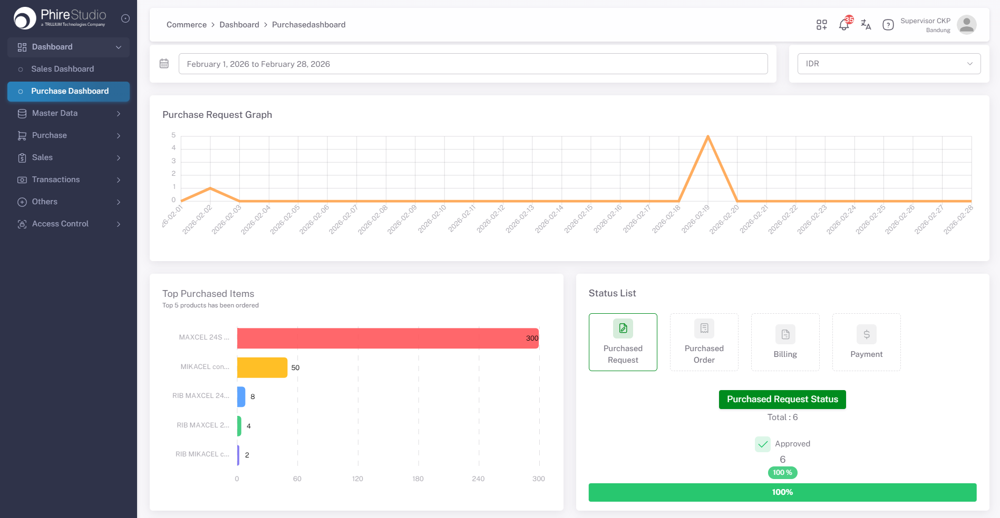
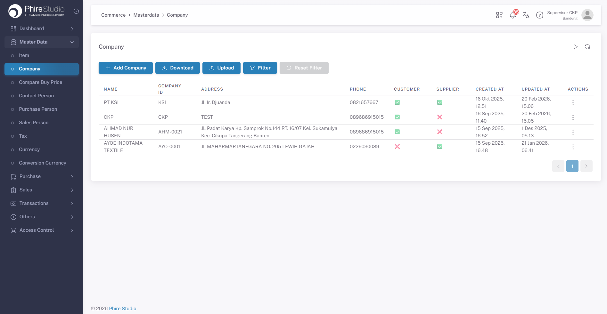
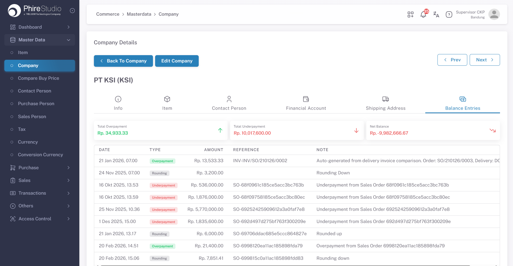
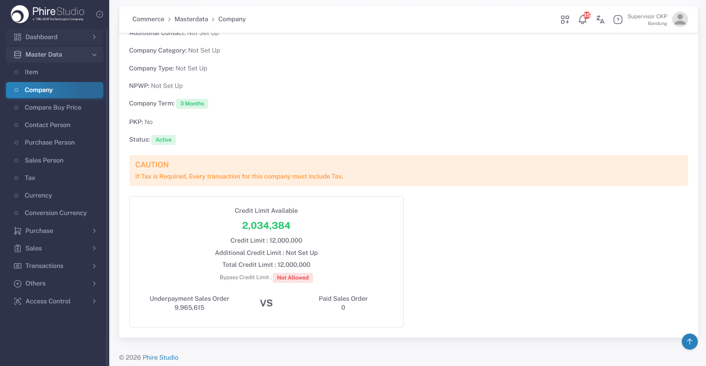
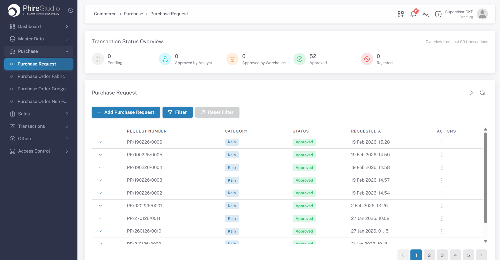
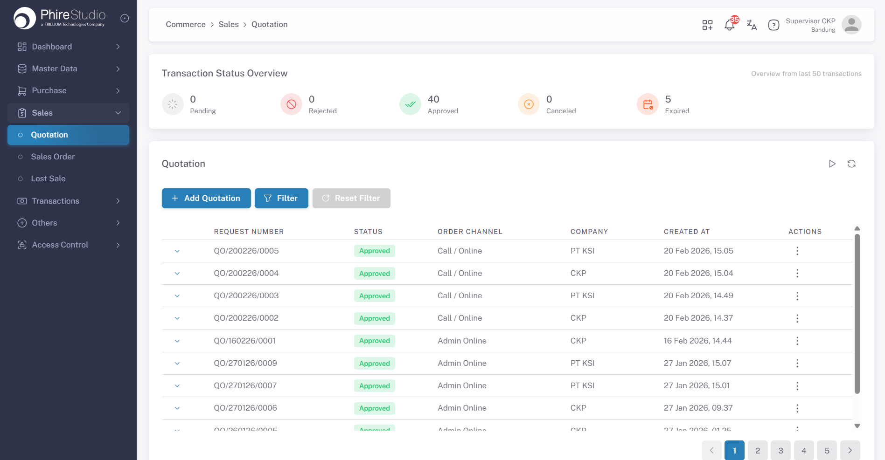
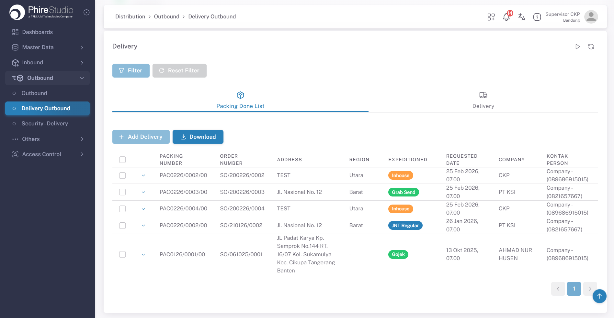
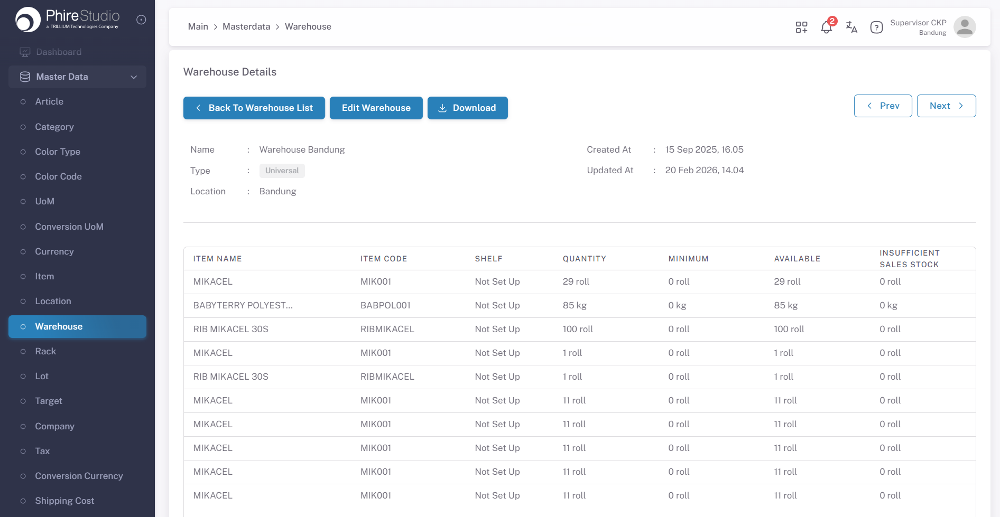
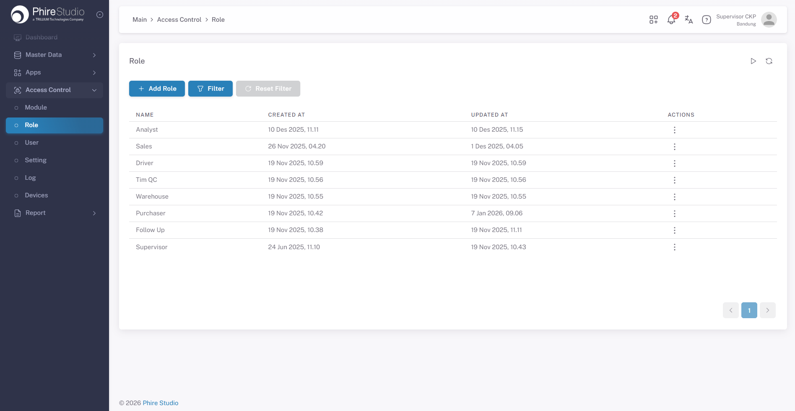
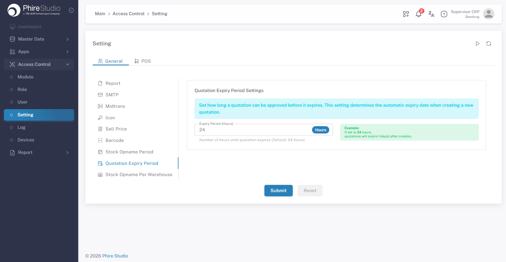

# Business Operation System – Work Portfolio

This repository presents an overview of my professional work as a Web Programmer involved in building an internal business operation system.

Due to company policy, the source code cannot be shared.  
This repository only documents the system scope, business flow, and interface design that I worked on.

---

## Project Overview

The system supports daily operational processes related to:

- purchase order
- sales order
- inventory management
- warehouse operations
- distribution process

The system is used internally by multiple departments and supports role-based access.

---

## Main Modules

### Master Data
- Item
- Company
- User
- Warehouse

### Purchasing & Sales
- Purchase Request
- Purchase Order
- Quotation
- Sales Order
- Status based approval flow
- Payment

### Distribution & Warehouse
- Inbound
- Unpacking
- Packing
- Outbound
- Delivery

---

## Roles in the System

The system is used by several operational roles, such as:

- Sales
- Purchasing
- Warehouse
- Security
- Super Admin
- Manager

Each role has different permissions and actions.

---

## My Responsibilities

In this project, I am involved in:

- implementing business workflow in the application
- building role-based user interfaces
- implementing form validation and business validation
- handling status-based actions and transitions
- supporting approval flow between roles
- integrating frontend and backend APIs

---

## Working Style

I apply a layered design approach where:

- the user interface only handles user interaction
- business rules and workflow logic are handled in a separate layer

This helps the system remain maintainable and scalable.

---

## System Flow (High Level)

1. User creates transaction (purchase, sales, or distribution process)
2. The system validates business rules
3. Transaction status is updated
4. Approval or operational actions are triggered based on role
5. Inventory and warehouse process are updated accordingly
6. History and tracking data are stored

---

## Technology Stack

### Backend
- Node.js
- Express
- TypeScript
- MongoDB (Mongoose)

### Frontend
- Vue 3
- Pinia
- Vuetify
- Vite

---

## Screenshots

### Dashboard

### Company List

### Company Balance Entries

### Company Credit Limit

### Purchase Request List

### Inbound

### Quotation List

### Delivery

### Warehouse Item List

### Role List

### User List

### Settings

---

## Notes

All screenshots are taken from an internal system and have been sanitized to remove any sensitive or confidential information.

This documentation is provided only to demonstrate my experience in building business workflow systems.

